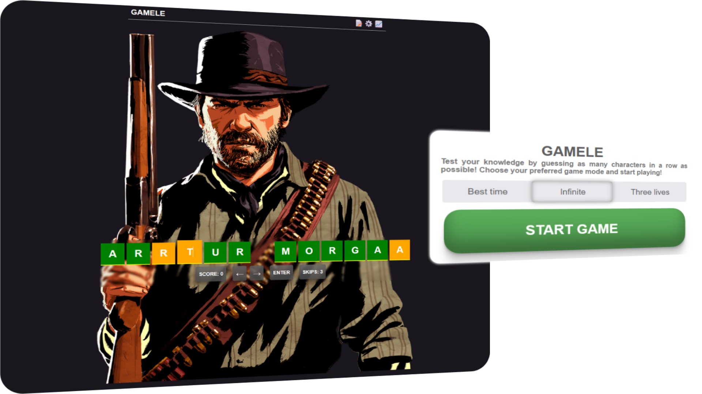

# Gamele
 Gamele is a character guessing game based on web technologies.

  

## Features

- **A variety of game modes, including:**
- **Best time:** guess as many characters as you can in a limited time period!
- **Infinite:** guess as many characters in a row as you can!
- **Three lives:** guess as many characters, but a wrong guess results in removing a life.

## How it functions / libraries

**Node.js:** used to fetch images stored in the repo   
**Js, HTML, CSS:** used for general components and building the website

## Contributing and feedback

Contributions are always welcome! We would love for others to contribute to this project, and it's improvement, currently it is in its early stages and may have issues.

Feedback is also extremely valuable. We am open to any feedback you have.

- To contribute or provide feedback, contact us at [will provide a method soon]

## License

The MIT License lets you do almost anything you want with this project, even making and distributing closed source versions.

